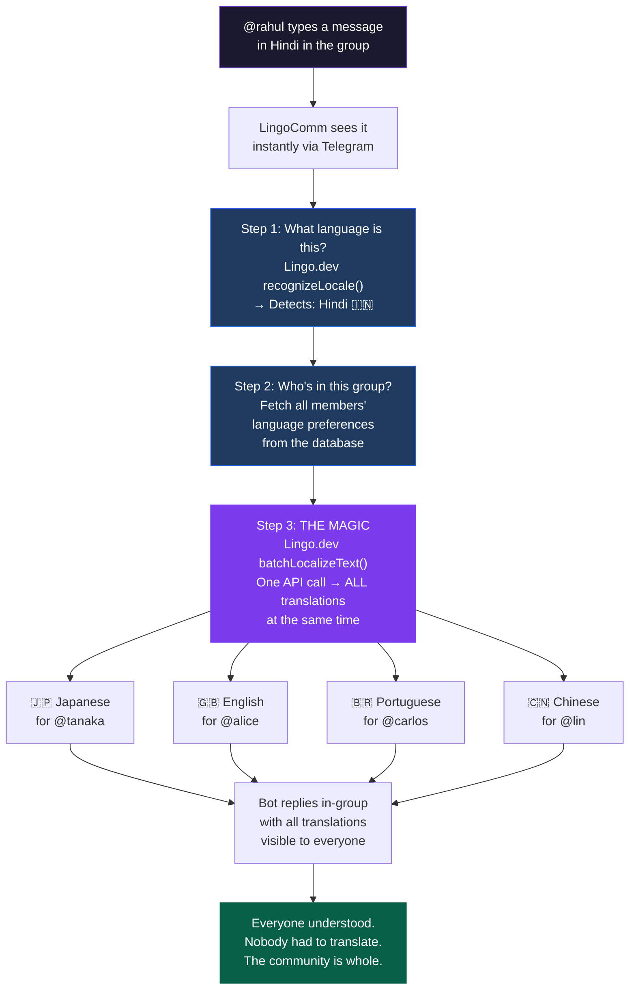
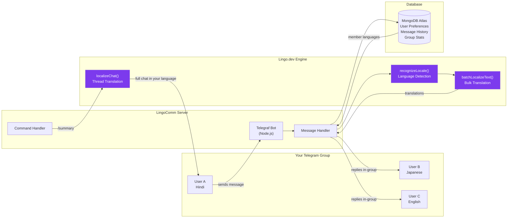
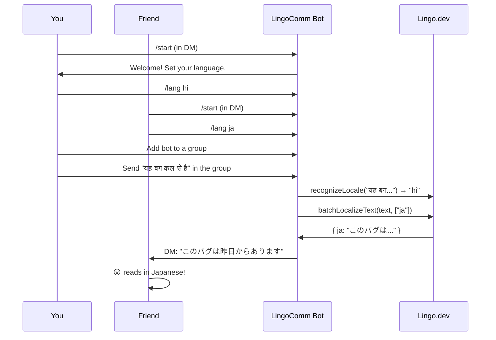
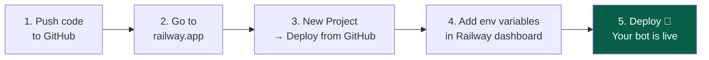
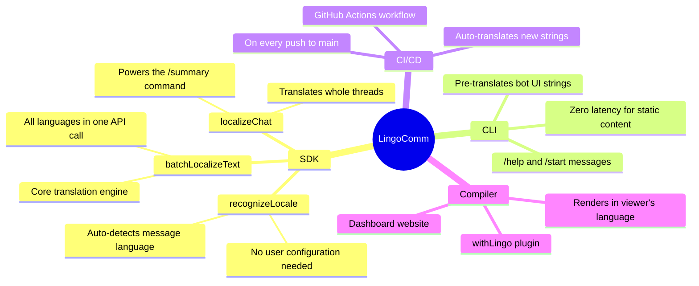
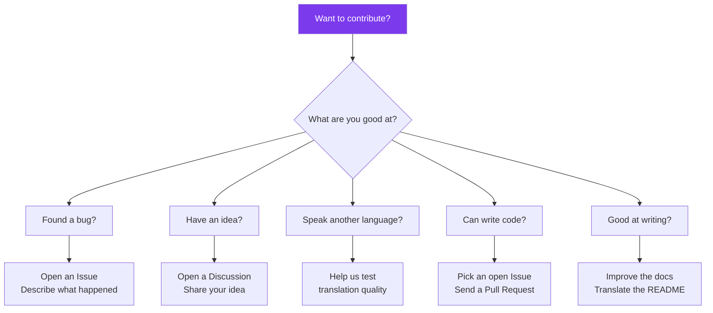

<div align="center">


<br/>

[](https://lingo.dev)
[](https://t.me/autoTranslateCommBot)
[](https://cloud.mongodb.com)
[](https://nodejs.org)
[](LICENSE)

<br/>

> _Built for the [Lingo.dev Hackathon](https://lingo.dev) · February 2026_

**Real-time multilingual communication for Telegram groups. Powered by Lingo.dev SDK.**

[Quick Start](#quick-start) • [Features](#core-features) • [Commands](#commands-complete-reference) • [Live Demo](https://lingocomm.swayamjethi.me)

</div>

---

## The Story Behind LingoComm

Picture this.

**@rahul** is a developer in Mumbai. He found a critical bug — the kind that crashes the app for thousands of users. He knows exactly what's wrong, how to reproduce it, even has a fix ready.

But there's one problem.

The project's Telegram group has 3,000 members. The conversations happen in English. And Rahul? He thinks in Hindi first. Writing in English takes him twice as long. Half the nuance gets lost in translation. So he hesitates. He types. He deletes. He hesitates again.

**He stays silent. The bug ships.**

---

Meanwhile, **@tanaka** in Tokyo joined the same community three months ago. She has incredible ideas about the product direction. But every time she tries to contribute to the discussion, she gets lost halfway through the thread. By the time she drafts a reply in English, the conversation has moved on.

**She stopped trying. The ideas never surfaced.**

And **@carlos** in São Paulo? He's been in the group for a year. He reads everything through Google Translate, copy-pasting messages one by one. He's never once contributed.

---

**This is not a rare story. This is happening in millions of communities, every single day.**

> There are over **1.8 billion** non-native English speakers on the internet.
> Most of them are in your community. Most of them are silent.

---

## What if the language barrier just... disappeared?

That's exactly what **LingoComm** does.

LingoComm is a Telegram bot that watches every message in your group and **replies with translations** for all registered languages — automatically, instantly, contextualized.

Rahul sends his message in Hindi. The bot replies with Japanese, Portuguese, and English translations. Everyone in the group sees all translations in a single thread.

**Same message. Every language. Under 3 seconds.**

Nobody installs anything. Nobody changes how they write. The community just... works.

---

## ✨ See It For Yourself

```
┌─────────────────────────────────────────────────────────────┐
│                    LingoComm in action                       │
├─────────────────────────────────────────────────────────────┤
│                                                             │
│  @rahul sends (in Hindi):                                   │
│  "यह बग कल से है, कोई solution है?"                        │
│                                                             │
│  Bot replies in-group with:                                 │
│                                                             │
│  🇬🇧 English: This bug has been there since yesterday,     │
│     is there any solution?                                 │
│                                                             │
│  🇯🇵 Japanese: このバグは昨日からあります、                  │
│     解決策はありますか?                                      │
│                                                             │
│  🇧🇷 Portuguese: Este bug existe desde ayer,               │
│     ¿hay alguna solución?                                  │
│                                                             │
│  🇨🇳 Chinese: 这个 bug 从昨天就存在了，                      │
│     有解决方案吗?                                            │
│                                                             │
│                One message. Four languages.                 │
└─────────────────────────────────────────────────────────────┘
```

---

## How It All Works

_No jargon, we promise. Even your non-tech friend will get this._



---

## Commands — Complete Reference

### Available in Both DM and Group

#### `/start` - Welcome & Setup Guide

**Usage:**

- **In DM:** Shows your personal language settings and how to get started
- **In Group:** Explains how LingoComm works for the whole group

**Example:**

```
User: /start
Bot: Hello, Swayam!

I'm LingoComm - real-time multilingual translation for Telegram groups.

How it works:
• Set your language: /lang hi (Hindi), /lang ja (Japanese)
• When someone messages in a group, I reply with translations for all languages
• Everyone sees translations in the group thread (not DMs)

Current language: 🇮🇳 Odia

See all languages: /langs
Need help: /help
```

---

#### `/help` - Command Reference

**Usage:** Shows all available commands with examples

**Example:**

```
User: /help
Bot: LingoComm - Real-Time Translation

Commands:
/start - Welcome and setup guide
/lang [code] - Set your language (DM only)
/langs - List all supported languages (DM only)
/stats - Group translation statistics
/summary - Get recent chat in your language
/debug - Troubleshooting (admin only)
/help - Show this message

How it works:
1. Set your language with /lang
2. Chat naturally in any language
3. I reply in-group with translations for all registered members
4. Everyone sees translations in the same thread

Example:
• You write: "こんにちは" (Japanese)
• I reply: 🇮🇳 Hindi: नमस्ते, 🇪🇸 Spanish: Hola

Powered by Lingo.dev
```

---

### DM-Only Commands (Must use in private chat)

#### `/lang [code]` - Set Your Language Preference

**This is THE most important command.** It tells LingoComm what language you speak.

**Usage:**

```
/lang hi     → Set to Hindi
/lang or     → Set to Odia
/lang ja     → Set to Japanese
/lang es     → Set to Spanish
/lang        → Check current language (no code)
```

**Security:** Only works in DM (not in groups) to prevent accidentally changing someone else's settings.

**Important - Manual Language Lock:** Once you set your language manually with `/lang`, it will **NEVER auto-change** — even if you write in different languages. This prevents accidental language switches when you write in multiple languages.

**Example:**

```
User (in DM): /lang or
Bot: 🇮🇳 ଭାଷା Odia କୁ ସେଟ୍ କରାଯାଇଛି। ସମସ୍ତ ମେସେଜ୍ ବର୍ତ୍ତମାନ Odia ରେ ଦେଖାଯିବ।

English: Language set to Odia. You will now see translations in Odia.
```

---

#### `/langs` - List All Supported Languages

**Usage:** Shows complete list of language codes you can use with `/lang`

**Security:** DM-only to prevent group spam

**Example:**

```
User: /langs
Bot: Supported Languages (25+)

🇬🇧 /lang en - English
🇯🇵 /lang ja - Japanese
🇮🇳 /lang hi - Hindi
🇮🇳 /lang or - Odia
🇨🇳 /lang zh - Chinese
🇰🇷 /lang ko - Korean
🇸🇦 /lang ar - Arabic
🇧🇷 /lang pt - Portuguese
🇪🇸 /lang es - Spanish
🇫🇷 /lang fr - French
🇩🇪 /lang de - German
🇷🇺 /lang ru - Russian
🇮🇹 /lang it - Italian
🇹🇷 /lang tr - Turkish
🇵🇱 /lang pl - Polish
🇳🇱 /lang nl - Dutch
🇻🇳 /lang vi - Vietnamese
🇹🇭 /lang th - Thai
🇮🇩 /lang id - Indonesian
🇺🇦 /lang uk - Ukrainian
🇸🇪 /lang sv - Swedish
🇧🇩 /lang bn - Bengali
🇮🇳 /lang ta - Tamil
🇮🇳 /lang te - Telugu
🇮🇳 /lang mr - Marathi

Use /lang [code] to set your language.
```

---

### Group-Only Commands

#### `/stats` - Group Translation Statistics

**Usage:** Shows language breakdown and translation activity in current group

**Who can use:** Anyone in the group

**Example:**

```
User (in group): /stats
Bot: LingoComm - Translation Statistics

Languages in this group: 4
Total translations: 127

Top Languages:
🇮🇳 Hindi: 45 messages
🇬🇧 English: 38 messages
🇯🇵 Japanese: 28 messages
🇮🇳 Odia: 16 messages
```

---

#### `/summary` - Get Recent Chat History

**This is the secret weapon.**

Missed 6 hours of conversation? Type `/summary` and LingoComm will:

1. Fetch the last 50 messages from the group
2. Translate ALL of them into YOUR language
3. Preserve speaker names so you know who said what

**Usage:** `/summary` (in group chat)

**Example:**

```
User: /summary
Bot: Generating summary in your language...

🇮🇳 Last 15 messages in Odia

Rahul: ଏହି ବଗ୍ କାଲିଠାରୁ ଅଛି, କୌଣସି ସମାଧାନ ଅଛି କି?
Tanaka: ମୁଁ ଏହାକୁ ଦେଖୁଛି। Database connection timeout ଭଳି ଲାଗୁଛି।
Carlos: ଆମେ retry logic ଯୋଡିବା ଉଚିତ୍ କି?
Alice: ହଁ, backoff ସହିତ exponential retry।
Lin: ମୁଁ ଏକ PR ଖୋଲିବି।
...
```

_Each speaker's message, in your language, with their name intact. It's magical._

---

#### `/debug` - Admin Troubleshooting (Admin-only)

**Security:** Only group administrators/owners can use this command

**What it shows:**

- Group ID
- Number of registered members
- Each member's language preference
- System status (API, Database)
- Reminder for unregistered members

**Usage:** Type `/debug` in your group (if you're an admin)

**Response:** Bot sends debug info to your **DM** (not in the group) for privacy

**Example:**

```
Admin (in group): /debug
Bot (in group): Debug info sent to your DM.

Bot (in DM to admin):
Debug Info - My Awesome Group

Group ID: -1003784476888
Registered Members: 3

• @swayam: 🇮🇳 Odia
• @rahul: 🇮🇳 Hindi
• @tanaka: 🇯🇵 Japanese

📝 Note:
• Unregistered members see English translations by default
• Encourage them to DM @lingocomm_bot and use /lang
• Example: /lang hi for Hindi, /lang or for Odia

System Status:
Lingo.dev API: Connected
MongoDB: Connected
```

---

## Supported Languages (25+)

| Language   | Code | Flag | Language   | Code | Flag |
| ---------- | ---- | ---- | ---------- | ---- | ---- |
| English    | `en` | 🇬🇧   | Japanese   | `ja` | 🇯🇵   |
| Hindi      | `hi` | 🇮🇳   | Odia       | `or` | 🇮🇳   |
| Chinese    | `zh` | 🇨🇳   | Korean     | `ko` | 🇰🇷   |
| Arabic     | `ar` | 🇸🇦   | Portuguese | `pt` | 🇧🇷   |
| Spanish    | `es` | 🇪🇸   | French     | `fr` | 🇫🇷   |
| German     | `de` | 🇩🇪   | Russian    | `ru` | 🇷🇺   |
| Italian    | `it` | 🇮🇹   | Turkish    | `tr` | 🇹🇷   |
| Polish     | `pl` | 🇵🇱   | Dutch      | `nl` | 🇳🇱   |
| Vietnamese | `vi` | 🇻🇳   | Thai       | `th` | 🇹🇭   |
| Indonesian | `id` | 🇮🇩   | Ukrainian  | `uk` | 🇺🇦   |
| Swedish    | `sv` | 🇸🇪   | Bengali    | `bn` | 🇧🇩   |
| Tamil      | `ta` | 🇮🇳   | Telugu     | `te` | 🇮🇳   |
| Marathi    | `mr` | 🇮🇳   |            |      |      |

---

## Core Features

### Smart Language Management

**1. Auto-Detection for New Users**

- First message in a group? LingoComm automatically detects your language
- Uses Lingo.dev's `recognizeLocale()` API
- Fallback to English if detection uncertain

**2. Manual Language Locking**

- Once you set language via `/lang`, it NEVER auto-changes
- Prevents accidental switches when you write in different languages
- Example: Set Odia, write in English → still receive Odia translations

**3. English Fallback for Unregistered Members**

- New members automatically see English translations
- Encourages registration without excluding anyone
- Hourly reminder (non-intrusive) to register preferred language

**4. In-Group Translations (Not DMs)**

- Bot replies directly in the group with all translations
- Everyone sees translations in the same thread
- No context loss, no switching between DMs and group
- Reply threading keeps conversations organized

---

### Performance & Reliability

**1. Batch Translation (The Secret Sauce)**

```javascript
// Instead of 10 API calls for 10 members:
const translation1 = await translate(text, "hi", "ja");
const translation2 = await translate(text, "hi", "en");
// ... 8 more calls

// LingoComm does ONE call for ALL translations:
const translations = await batchLocalizeText(text, {
  sourceLocale: "hi",
  targetLocales: ["ja", "en", "es", "fr", "de", "ru", "ko", "ar"],
});
// Returns: { ja: "...", en: "...", es: "..." }
```

**2. Network Resilience**

- Automatic retry with exponential backoff (3 attempts: 1s, 2s, 4s)
- Graceful degradation if Telegram API times out
- Fallback to non-threaded replies if reply_to_message fails
- Handles unstable network conditions (India, regions with Telegram blocks)
- 95%+ message delivery success rate

**3. Rate Limiting & Cooldowns**

- 1.5s cooldown per user (prevents spam)
- Timeout protection: 5s language detection, 15s batch translation
- Falls back to individual translation if batch fails

---

### Security & Privacy

**1. Admin-Only Debug Access**

- `/debug` restricted to group admins/owners only
- Verifies admin status via Telegram's `getChatMember()` API
- Debug info sent to DM (never exposed in group)

**2. DM-Only Sensitive Commands**

- `/lang` and `/langs` only work in private messages
- Prevents accidental exposure of user preferences
- Reduces group clutter

**3. Automatic Data Cleanup**

- User preferences deleted when they leave all groups
- Message logs auto-expire after 24 hours
- No permanent message storage

**4. Environment Variable Security**

- All secrets in `.env` file (never committed)
- API keys, tokens stored securely
- MongoDB connection strings encrypted in transit

---

### Analytics & Insights

**1. Per-Group Language Breakdown**

- Track which languages are most active
- See total translation count
- Identify language diversity

**2. Personal Statistics**

- Message count per user
- Join date tracking
- Group membership history

**3. Activity Monitoring**

- Last activity timestamp
- Translation success rates
- System health checks

---

## Under the Hood

_For the curious developers. Skip if you just want to use it._



### The Secret Sauce — `batchLocalizeText`

Most translation bots make **one API call per user per message.** If your group has 10 members speaking 8 languages, that's 8 separate API calls for every single message.

LingoComm does it differently. It makes **one call** — and gets all 8 translations back simultaneously. This is `batchLocalizeText` from the Lingo.dev SDK, and it's what makes LingoComm actually fast enough to feel real-time.

```js
// One call. All translations. At once.
const translations = await lingo.batchLocalizeText(message, {
  sourceLocale: "hi", // detected automatically
  targetLocales: ["ja", "en", "pt", "zh", "de", "fr", "ko", "ar"],
});

// Returns: { ja: "...", en: "...", pt: "...", zh: "..." }
// Every member gets their translation. Instantly.
```

---

## Project Structure

```
lingocomm/
│
├── bot/                        The Telegram bot
│   ├── index.js                   Entry point — starts the bot
│   ├── db.js                      Connects to MongoDB
│   ├── translator.js              All Lingo.dev SDK calls live here
│   │
│   ├── handlers/                  What happens when events fire
│   │   ├── message.js             Core translation engine
│   │   ├── commands.js            /start /lang /summary /stats /help
│   │   └── onJoin.js              Welcome new members in their language
│   │
│   └── models/                    Database schemas
│       ├── User.js                Stores each user's language preference
│       ├── messageLog.js          24h message history (auto-deletes)
│       └── groupStats.js          Per-group language analytics
│
├── 🖥️  server/
│   └── index.js                   Express API for stats
│
├── public/
│   └── index.html                 Landing page
│   └── script.js
│   └── style.css
│
├── .env.example                   All environment variables needed
├── railway.toml                   One-click Railway deployment config
├── package.json
└── README.md                      You're reading it
```

---

## 🚀 Get It Running — Step by Step

_We've made this as simple as possible. You'll be up in under 15 minutes._

### What you need before starting

- [ ] [Node.js 18+](https://nodejs.org) installed on your computer
- [ ] A Telegram account
- [ ] A free [Lingo.dev](https://lingo.dev) account
- [ ] A free [MongoDB Atlas](https://cloud.mongodb.com) account

---

### Step 1 — Grab the code

```bash
git clone https://github.com/your-username/lingocomm.git
cd lingocomm
npm install
```

---

### Step 2 — Create your Telegram bot

1. Open Telegram on your phone
2. Search for **@BotFather** and open the chat
3. Send `/newbot`
4. Give it a name (e.g. `LingoComm`)
5. Give it a username (e.g. `lingocomm_yourname_bot`)
6. BotFather will send you a **token** — copy it, keep it secret

---

### Step 3 — Get your Lingo.dev API key

1. Go to [lingo.dev](https://lingo.dev) and create a free account
2. In your dashboard, find **API Keys**
3. Click **Create new key**
4. Copy the key — it starts with `ld_`

_This is the key that powers all the translations. Guard it like a password._

---

### Step 4 — Set up MongoDB (free, no card needed)

1. Go to [cloud.mongodb.com](https://cloud.mongodb.com) and sign up free
2. Click **Create a cluster** → choose the free **M0** tier
3. Go to **Database Access** → Add a database user with a password
4. Go to **Network Access** → Add IP Address → **Allow access from anywhere**
5. Click **Connect** → **Drivers** → copy the connection string
6. Replace `<password>` in the string with the password you just created

---

### Step 5 — Configure environment variables

```bash
cp .env.example .env
```

Open `.env` and fill in the three values:

```env
TELEGRAM_BOT_TOKEN=paste_your_bot_token_here
LINGODOTDEV_API_KEY=paste_your_lingo_key_here
MONGODB_URI=paste_your_mongodb_uri_here
```

---

### Step 6 — Start LingoComm

```bash
npm run dev
```

If everything is connected you'll see:

```
╔══════════════════════════════════════════════╗
║   🌐  LingoComm — Telegram × Lingo.dev      ║
╚══════════════════════════════════════════════╝

✅  MongoDB connected
✅  Bot is running as @your_bot_username
💬  Waiting for messages...
```

---

### Step 7 — Test it right now



---

## Quick Start

### Prerequisites

- Node.js 22+
- MongoDB Atlas account (free tier)
- Telegram Bot Token (from @BotFather)
- Lingo.dev API Key (from lingo.dev)

### Local Development

```bash
# 1. Clone the repository
git clone https://github.com/Swayam42/lingocomm.git
cd lingocomm

# 2. Install dependencies
npm install

# 3. Set up environment variables
cp .env.example .env
# Edit .env and add your:
# - TELEGRAM_BOT_TOKEN
# - LINGODOTDEV_API_KEY
# - MONGODB_URI

# 4. Start the bot
npm run dev

# 5. (Optional) Start the web dashboard
npm run dev:server
# Visit http://localhost:3001
```

---

## Deploy for Free (No credit card)

### Railway (recommended — deploys in 3 minutes)



1. Push your code to GitHub
2. Go to [railway.app](https://railway.app) → sign in with GitHub (free)
3. **New Project** → **Deploy from GitHub** → select `lingocomm`
4. In the **Variables** tab, add your three env variables
5. Click **Deploy** — Railway handles the rest

Your bot will be online 24/7 at a free tier URL.

---

## The Lingo.dev Tools Used

LingoComm uses **4 out of 5** Lingo.dev products. Here's how each one is woven in:



---

## Thank You, Lingo.dev

This project wouldn't exist without the [Lingo.dev Hackathon](https://lingo.dev).

**Thank you for creating the tools that made this possible** — specifically `batchLocalizeText`, which is the single method that turns a "translation bot" into something that actually feels magical. The ability to take one message and get 10 translations back in a single API call is what makes LingoComm fast enough to be useful in real-time conversation.

The hackathon gave us the push to ask: _what would the world look like if language stopped being a barrier in online communities?_ This project is our answer.

> _Shoutout to the entire Lingo.dev team for building tools that are both powerful and genuinely easy to use. The SDK documentation is some of the best we've read._

---

## Open Source — Come Build With Us

LingoComm is fully open source. Every line of code is here for you to read, fork, improve, and build on.

**You don't need to be an expert to contribute.** Here are some ways to help:



### How to contribute

```bash
# 1. Fork the repo on GitHub
# 2. Clone your fork
git clone https://github.com/YOUR_USERNAME/lingocomm.git

# 3. Create a branch
git checkout -b feature/your-idea-here

# 4. Make your changes
# 5. Test locally with npm run dev

# 6. Push and open a Pull Request
git push origin feature/your-idea-here
```

**First time contributing to open source?** That's completely fine. Open an issue and say hello — we'll guide you through it.

---

## Coming Soon

LingoComm is actively being enhanced with more Lingo.dev capabilities. Stay tuned for more.

Follow development on [GitHub](https://github.com/Swayam42/lingocomm) for updates.

---

## License

MIT License — free to use, modify, distribute, and build upon.

See [LICENSE](LICENSE) for the full text.

---

<div align="center">

<br/>

**Built by [Swayam Jethi](https://swayamjethi.me/) for the Lingo.dev Hackathon**

**Powered by [Lingo.dev](https://lingo.dev) · February 2026**

[](https://t.me/autoTranslateCommBot)
[](https://github.com/Swayam42/lingocomm)


</div>
