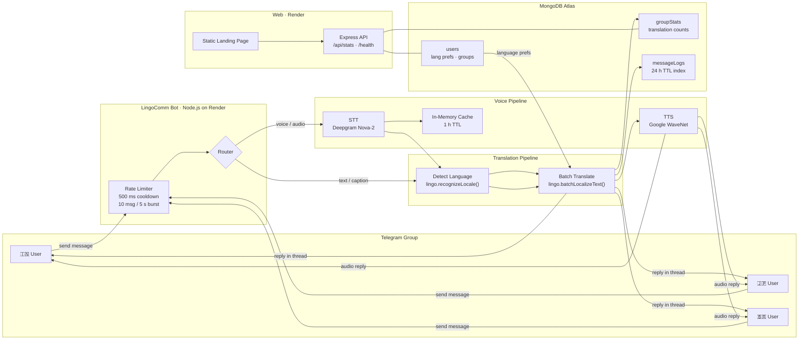
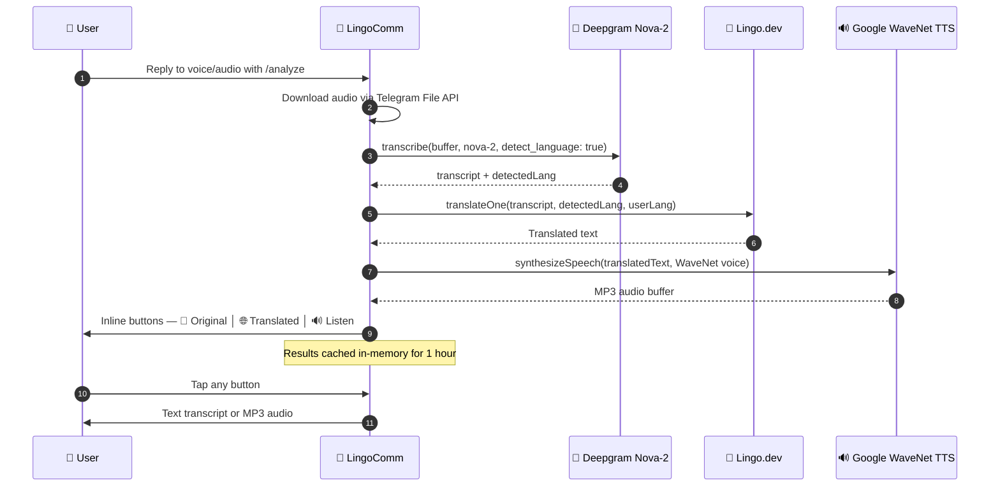

<div align="center">

# 🌐 LingoComm

### Real-time multilingual translation bot for Telegram communities

[](https://lingo.dev)
[](https://t.me/autoTranslateCommBot)
[](https://lingocomm-bot.onrender.com)

---

> **80 % of internet users don't speak English natively.**
> In multilingual tech groups, developers from Brazil, Japan, and India stay silent — because manual translation takes minutes and the conversation has already moved on.

**LingoComm** fixes this by translating every group message into each member's preferred language in real time, across **25+ languages**.

```
@rahul (🇮🇳) :  मुझे बग मिला

LingoComm  →  🇬🇧 English: I found a bug
               🇯🇵 Japanese: バグを見つけました`
               🇧🇷 Portuguese (Brazil): Encontrei um bug
```

**Core innovation:** Lingo.dev's `batchLocalizeText()` — **1 API call** translates into all target languages simultaneously (10× faster than sequential translation loops).

</div>

---

## 📑 Table of Contents

- [How It Works](#-how-it-works)
- [Architecture](#-architecture)
- [Features](#-features)
- [Commands](#-commands)
- [Voice Analysis Pipeline](#-voice-analysis-pipeline)
- [Project Structure](#-project-structure)
- [Tech Stack](#-tech-stack)
- [Database Schemas](#-database-schemas)
- [Deployment](#-deployment)
- [Local Development](#-local-development)
- [Why Lingo.dev?](#-why-lingodev)

---

## 🔄 How It Works

1. **Add LingoComm** to your Telegram group
2. Each member sets their preferred language via `/lang` in a DM
3. Anyone sends a message in **any** language
4. LingoComm auto-detects the language, batch-translates, and replies in-thread with translations for every other language in the group

> Members who haven't set a preference are auto-detected based on their Telegram language and the language they write in.

---

## 🏗 Architecture



> **Deploy topology:** `start.js` spawns both the Telegram bot process and the Express server as child processes. Render runs this as a single web service — the bot uses Telegram long-polling while Express serves the API and static landing page on the configured port (default `3001`).

---

## ✨ Features

| | Feature | Details |
|---|---------|---------|
| 🌐 | **Real-Time Translation** | Every text message is auto-translated to all group members' languages using a single `batchLocalizeText()` call |
| 🖼 | **Caption Translation** | Photo and document captions are translated just like text messages |
| 🎙 | **Voice Analysis** | Reply `/analyze` to a voice note → Deepgram transcribes → Lingo.dev translates → Google TTS synthesizes audio in your language |
| 🔗 | **Smart Content Handling** | URLs, code blocks, and emojis are preserved during translation — never broken |
| 🏷 | **Language Lock** | Set your language once with `/lang`; the bot remembers it even if you leave and rejoin |
| 🤖 | **Auto-Detection** | New users are auto-registered with language detected from their Telegram client and first message |
| 🛡 | **Rate Limiting** | 500 ms per-user cooldown + 10-message burst window prevents spam and API abuse |
| 🔁 | **Retry Logic** | Bot launch, MongoDB connection, and Telegram API calls all have exponential back-off retries |
| 📊 | **Personal Stats** | `/stats` in a group shows your language, message count, and membership info |
| 🔧 | **Admin Debug** | `/debug` (admin-only in groups) sends full diagnostics to your DM — registered members, language prefs, API status |
| 📈 | **Dashboard API** | Express REST API exposes live stats with geo-mapped language data |

---

## 🤖 Commands

| Command | Where | What it does |
|---------|-------|--------------|
| `/start` | DM / Group | Onboarding card with setup guide + inline keyboard |
| `/help` | DM / Group | List all commands and usage examples |
| `/lang <code>` | **DM only** | Set your preferred language (e.g. `/lang hi`) |
| `/langs` | **DM only** | Show all 27 supported language codes |
| `/stats` | **Group only** | Your personal stats in the current group |
| `/analyze` | **Group** (reply to voice/audio) | Transcribe + translate + generate TTS audio |
| `/debug` | **Group only** (admin) | Send full group diagnostic info to your DM |

### Supported Languages

 `/lang en` – English  
 `/lang ja` – Japanese  
 `/lang hi` – Hindi  
 `/lang or` – Odia  
 `/lang zh` – Chinese  
 `/lang zh-cn` – Chinese (Simplified)  
 `/lang ko` – Korean  
 `/lang ar` – Arabic  
 `/lang pt` – Portuguese  
 `/lang pt-br` – Portuguese (Brazil)  
 `/lang es` – Spanish  
 `/lang fr` – French  
 `/lang de` – German  
 `/lang ru` – Russian  
 `/lang it` – Italian  
 `/lang tr` – Turkish  
 `/lang pl` – Polish  
 `/lang nl` – Dutch  
 `/lang vi` – Vietnamese  
 `/lang th` – Thai  
 `/lang id` – Indonesian  
 `/lang uk` – Ukrainian  
 `/lang sv` – Swedish  
 `/lang bn` – Bengali  
 `/lang ta` – Tamil  
 `/lang te` – Telugu  
 `/lang mr` – Marathi


---

## 🎙 Voice Analysis Pipeline



---

## 📂 Project Structure

```
lingocomm/
├── bot/
│   ├── index.js              # Bot init, env validation, middleware, retry launch
│   ├── db.js                 # MongoDB connection with retry + reconnect handling
│   ├── translator.js         # Lingo.dev SDK — detectLanguage, translateToMany, translateOne
│   ├── handlers/
│   │   ├── message.js        # Text + photo/document caption translation engine
│   │   ├── commands.js       # /start /lang /langs /stats /help /debug + inline keyboards
│   │   ├── onJoin.js         # Member join/leave — auto-register, welcome messages
│   │   └── voiceAnalyzer.js  # Deepgram STT → Lingo.dev → Google TTS pipeline
│   └── models/
│       ├── User.js           # User preferences, groups, message count
│       ├── groupStats.js     # Per-group translation analytics
│       └── messageLog.js     # Message log with 24 h TTL index
├── server/
│   └── index.js              # Express API — /api/stats, /health, /healthz + static files
├── public/
│   ├── index.html            # Landing page
│   ├── script.js             # Dashboard stats fetching + animation
│   └── style.css             # Custom CSS with cursor effects
├── misc/
│   ├── DEPLOYMENT.md
│   ├── DEPLOYMENT_GUIDE.md
│   ├── TEST_PLAN.md
│   ├── TESTING_GUIDE.md
│   ├── VOICE_ANALYSIS_SETUP.md
│   └── analyze.md
├── start.js                  # Entry point — spawns bot + server as child processes
├── package.json
└── .env.example
```

---

## 🧰 Tech Stack

| Layer | Technology | Role |
|-------|-----------|------|
| **Bot Framework** | Telegraf.js `4.16.3` | Telegram Bot API, middleware, inline keyboards |
| **Translation** | Lingo.dev SDK `0.131.1` | `recognizeLocale()` + `batchLocalizeText()` + `localizeText()` |
| **Speech-to-Text** | Deepgram SDK `4.11.3` | Nova-2 model, auto language detection |
| **Text-to-Speech** | Google Cloud TTS `6.4.0` | WaveNet neural voices for 13 locales |
| **Database** | MongoDB Atlas (Mongoose `8.3.0`) | User prefs, group stats, message logs |
| **Web Server** | Express.js `4.18.3` | REST API + static file serving |
| **Runtime** | Node.js 22.x (ES Modules) | Top-level `await`, `--watch` for dev |
| **Hosting** | Render | Single web service (bot + API) |

---

## 💾 Database Schemas

```js
// User — language preferences & group memberships
{
  telegramId: Number,       // unique
  username: String,
  firstName: String,
  locale: String,           // "en", "hi", "ja", ...
  manuallySet: Boolean,     // true = user ran /lang; false = auto-detected
  messageCount: Number,
  groups: [String],         // group IDs the user belongs to
  joinedAt: Date
}

// GroupStats — per-group analytics
{
  groupId: Number,          // unique
  groupName: String,
  totalTranslations: Number,
  memberCount: Number,
  languageBreakdown: Map<String, Number>,  // { "hi": 15, "en": 10 }
  lastActivity: Date
}

// MessageLog — auto-deleted after 24 hours (TTL index on sentAt)
{
  groupId: Number,
  userId: Number,
  username: String,
  text: String,
  detectedLocale: String,
  sentAt: Date
}
```

### REST API

```
GET  https://lingocomm-bot.onrender.com/api/stats   — users, translations, groups, language breakdown, map pins
GET  https://lingocomm-bot.onrender.com/health       — health check
GET  https://lingocomm-bot.onrender.com/healthz      — health check with uptime
```

---

## 🚀 Deployment

### Render (Production)

LingoComm is live at **[lingocomm-bot.onrender.com](https://lingocomm-bot.onrender.com)**

1. Push the repo to GitHub
2. Render Dashboard → **New Web Service** → connect the repo
3. Configure build & start:
   ```
   Build Command:  npm install
   Start Command:  node start.js
   ```
4. Add environment variables:

   | Variable | Source |
   |----------|--------|
   | `TELEGRAM_BOT_TOKEN` | [@BotFather](https://t.me/BotFather) |
   | `LINGODOTDEV_API_KEY` | [lingo.dev](https://lingo.dev) |
   | `MONGODB_URI` | [MongoDB Atlas](https://cloud.mongodb.com) |
   | `DEEPGRAM_API_KEY` | [deepgram.com](https://deepgram.com) *(for /analyze)* |
   | `GOOGLE_APPLICATION_CREDENTIALS` | Google Cloud Console *(path to service account JSON — for /analyze TTS)* |
   | `PORT` | Port for Express server (default `3001`) |
   | `ADMIN_USERNAME` | Your Telegram username |

5. Click **Deploy**

> ⚠️ Render's free tier sleeps after 15 min of inactivity. Use Paid tier or a keep-alive ping service for production bots.

---

## 💻 Local Development

```bash
git clone https://github.com/Swayam42/lingocomm.git
cd lingocomm
npm install

cp .env.example .env
# Fill in: TELEGRAM_BOT_TOKEN, LINGODOTDEV_API_KEY, MONGODB_URI
# Optional: DEEPGRAM_API_KEY, GOOGLE_APPLICATION_CREDENTIALS, ADMIN_USERNAME

# Start both bot + server
npm start

# Or run just the bot in watch mode (auto-restarts on changes)
npm run dev

# Or run just the Express server
npm run server
```

---

## 🔬 Why Lingo.dev?

```js
// ❌ Traditional — N sequential API calls for N languages
for (const lang of targetLanguages) {
  await someTranslateAPI(text, lang);   // 10 calls, 4 – 8 seconds
}

// ✅ Lingo.dev — 1 call, all languages at once
const translations = await lingo.batchLocalizeText(text, {
  sourceLocale: "hi",
  targetLocales: ["en", "ja", "pt", "es", "fr", "de", "ko", "ar", "zh", "ru"],
});
```

| Metric | Traditional | Lingo.dev |
|--------|-------------|-----------|
| API calls (10 langs) | 10 | **1** |
| Avg response time | 4 – 8 s | **0.8 – 1.5 s** |
| Cost at scale | High | **~90 % less** |
| Language support | Varies | **100+** |

**Additional Lingo.dev features used:**
- `recognizeLocale()` — auto-detect source language without a full translation call
- `localizeText()` with `fast: true` — single-target translation for UI strings and fallbacks
- Batch fallback — if `batchLocalizeText()` fails, graceful degradation to individual `localizeText()` calls

---

<div align="center">

**Built for the [Lingo.dev Multilingual Hackathon](https://lingo.dev) · February 2026**

[](https://t.me/autoTranslateCommBot)
[](https://lingocomm-bot.onrender.com)
[](https://github.com/Swayam42/lingocomm)

---

*"Language should never be a barrier to brilliant ideas."*

</div>
